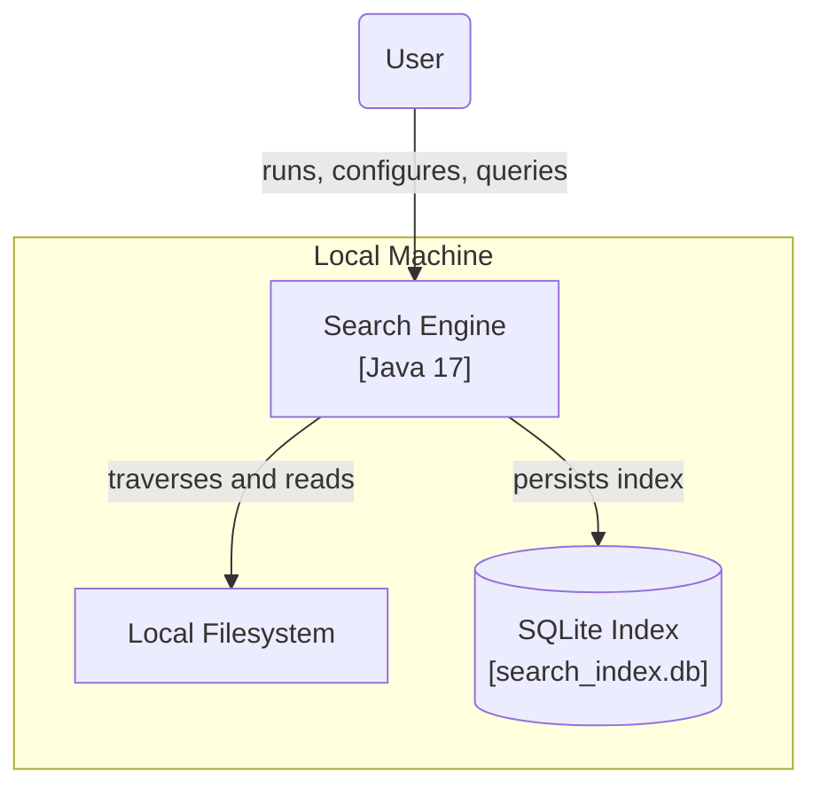
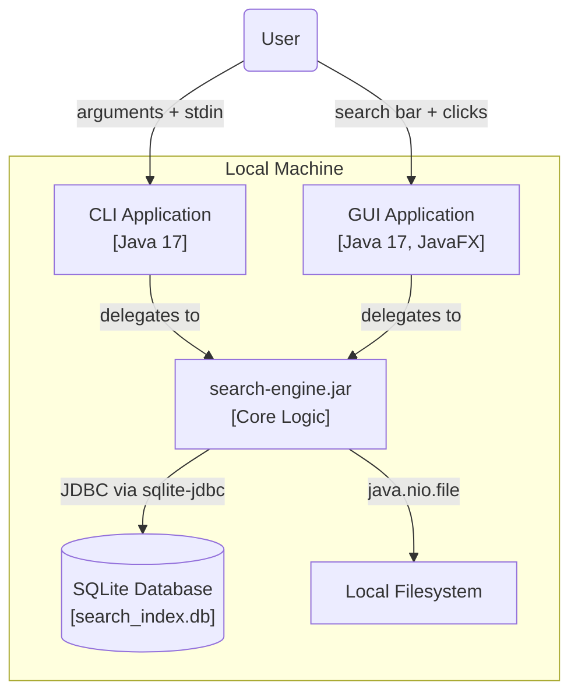
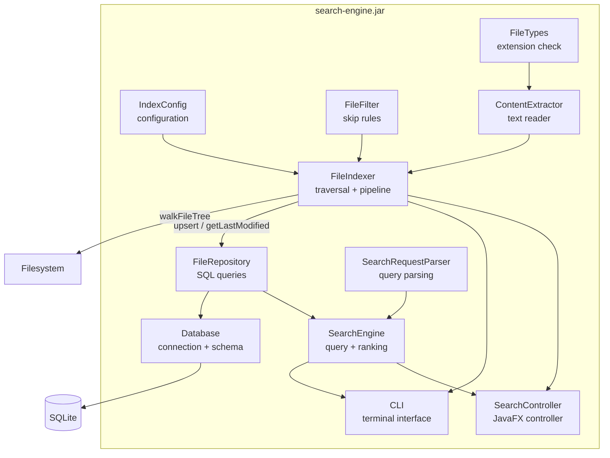
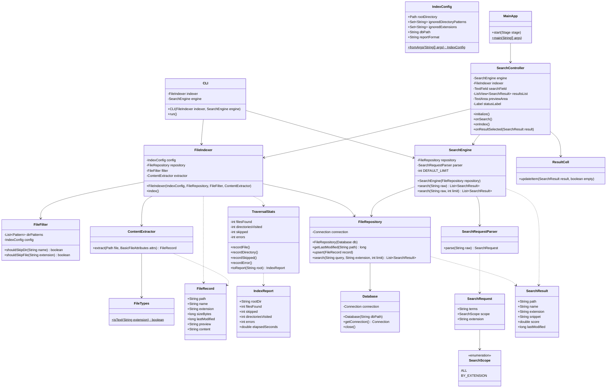
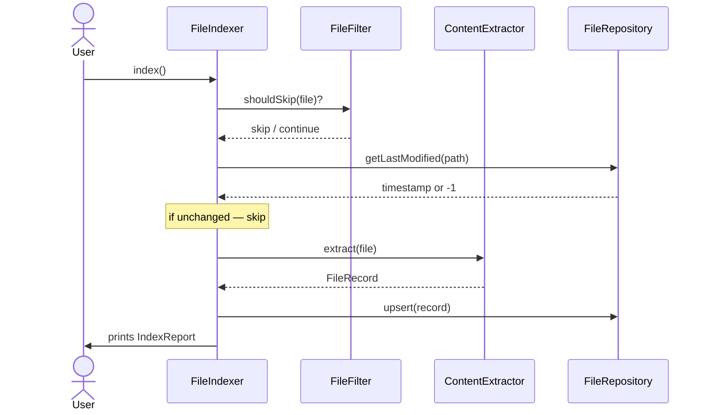
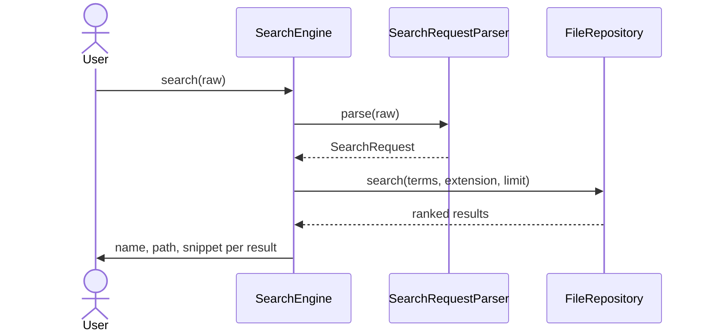
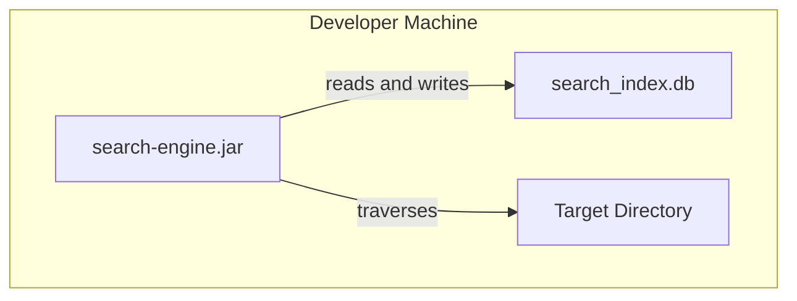

# Search Engine: Architecture Document

Software Design 2026 | Iteration 1

---

## 1. System Context

A local file search tool. Point it at a directory, it indexes everything, then
answers keyword queries with ranked results and file previews. No server, no
background process, no internet. The index is a single file on disk that persists
between runs, only changed files get re-processed.

**User** —> points the tool at a directory, waits for indexing to finish, types
queries either in the terminal or through the GUI.

**Local Filesystem** —> read-only from the engine's perspective. Source of all
file metadata and content.

**SQLite** —> single `.db` file on disk. FTS5 extension gives full-text search and
BM25 ranking with no extra dependencies.

---

## 2. Containers

Two frontends, one core, one database. CLI and GUI both delegate to the same core
logic: neither owns any indexing or search code directly.

| Container | Technology | Responsibility |
|-----------|------------|----------------|
| **CLI Application** | Java 17 | Argument parsing, indexing run, interactive search loop, printed results |
| **GUI Application** | Java 17, JavaFX | Search bar, ranked results list, file preview panel |
| **search-engine.jar** | Java 17, Maven | All core logic — crawling, filtering, extracting, indexing, searching |
| **search_index.db** | SQLite 3, FTS5 | File metadata and full-text inverted index |

---

## 3. Components

Seven components inside the JAR. The indexing pipeline flows through `FileIndexer`.
`SearchEngine` is completely independent, used by both CLI and GUI.
`SearchController` wires the GUI to the core.

| Component | Package | Responsibility |
|-----------|---------|----------------|
| **IndexConfig** | `app.config` | Immutable record — root path, ignore patterns, db path, report format. Built from CLI args |
| **FileFilter** | `app.indexer` | Regex patterns compiled once at startup, tested against every directory name and file extension |
| **FileTypes** | `app.util` | Single source of truth for which extensions are treated as readable text |
| **ContentExtractor** | `app.processor` | Reads UTF-8 text files, returns full content and a 3-line preview. Binary files get null |
| **FileIndexer** | `app.indexer` | Drives the traversal. `FileFilter` and `ContentExtractor` injected. Skips unchanged files by comparing timestamps |
| **Database** | `app.db` | Owns the SQLite connection and creates the schema on first run |
| **FileRepository** | `app.db` | All file-related SQL — `getLastModified`, `upsert`, `search` |
| **SearchRequestParser** | `app.search` | Parses raw input into a `SearchRequest`, extracts `ext:` filters |
| **SearchEngine** | `app.search` | Delegates to `SearchRequestParser`, calls `FileRepository`, returns BM25-ranked results |
| **CLI** | `app.cli` | Runs the interactive search loop, formats and prints results |
| **SearchController** | `app.gui` | JavaFX controller — handles search bar input, result selection, and preview display |

---

## 4. Classes

GUI layout: search bar at the top, scrollable results list in the middle showing
filename, path and snippet per result, preview panel on the right showing the full
file content when a result is clicked, status bar at the bottom for indexing progress
and result count.

---

## Runtime Behaviour

### Indexing

`FileIndexer` walks the tree. Each file is checked against `FileFilter` first, then
against the stored timestamp via `FileRepository`. Only new or modified files get
extracted and written to the index.

### Search

Raw input goes into `SearchEngine`, `SearchRequestParser` breaks it into terms and
an optional extension filter, `FileRepository` runs the FTS5 query, results come
back ranked by BM25.

---

## Deployment

Runs on any machine with JRE 17. sqlite-jdbc is bundled in the JAR so nothing
needs installing. Database file is auto-created on first run.

